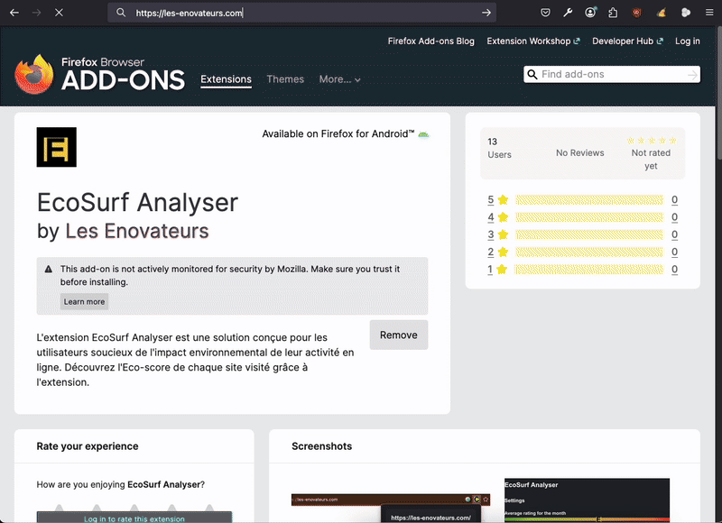

# EcoSurf Analyser 🌱

> **Measure the ecological impact of websites you visit in real-time**

EcoSurf Analyser is a browser extension that displays the ecological score of any webpage directly in your browser's navigation bar. See at a glance whether a website is environmentally friendly or not!

## 🌍 Why EcoSurf?

With the growing environmental impact of digital technologies, understanding the carbon footprint of the websites we visit is crucial. EcoSurf Analyser makes this information accessible with a simple grading system from A (eco-friendly) to G (high impact).

## ✨ Features

- Real-time ecological assessment of any website
- Simple A-G grading system visible in your browser's toolbar
- Automatic analysis of websites not yet in the database
- Works across popular browsers

## 📥 Installation

### From Official Stores

### Manual Installation (Firefox)

1. Download the repository
2. Open Firefox and navigate to `about:debugging#/runtime/this-firefox`
3. Click on "Load Temporary Add-on..."
4. Select the `manifest.json` file located in the EcoSurfAnalyser folder

## 🔍 How It Works

1. When you visit a website, EcoSurf contacts the EcoIndex API to check if that site has been analyzed
2. If data exists, you'll see the ecological score (A-G) in your browser's toolbar
3. If no data exists, EcoSurf requests a new analysis from the EcoIndex API
4. Using a smart heuristic approach, the extension will periodically check for new results

## 🧪 Technical Details

EcoSurf Analyser integrates with the [EcoIndex API](https://github.com/cnumr/ecoindex_api), which measures:
- Page weight
- DOM complexity
- Server requests
- And many other factors that impact a site's carbon footprint

## 👥 About Us

EcoSurf Analyser is developed by [Les E-novateurs](https://les-enovateurs.com/), a non-profit media organization dedicated to raising awareness about the environmental impact of digital technologies among both the general public and professionals. Our mission is to promote sustainable digital practices through education, tools, and community engagement.

## 🤝 Contributing

We welcome contributions from the community! Here's how you can help:

- **Found a bug?** Open an [issue](https://github.com/les-enovateurs/estimate-good-website/issues) (please search first to avoid duplicates)
- **Have an improvement?** Create a [pull request](https://github.com/les-enovateurs/estimate-good-website/pulls)
- **Spread the word!** Share this tool with developers and environmentally-conscious web users

---

Made with ❤️ for a more sustainable web

